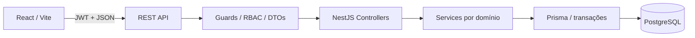
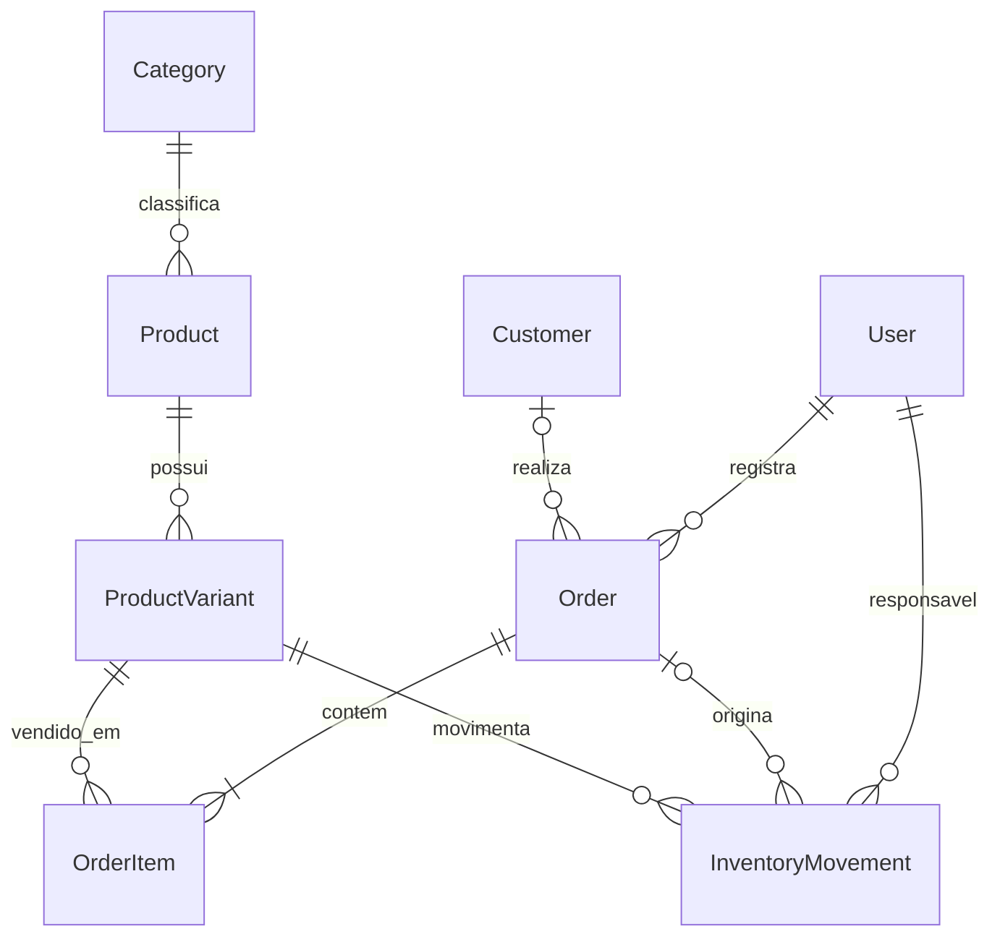
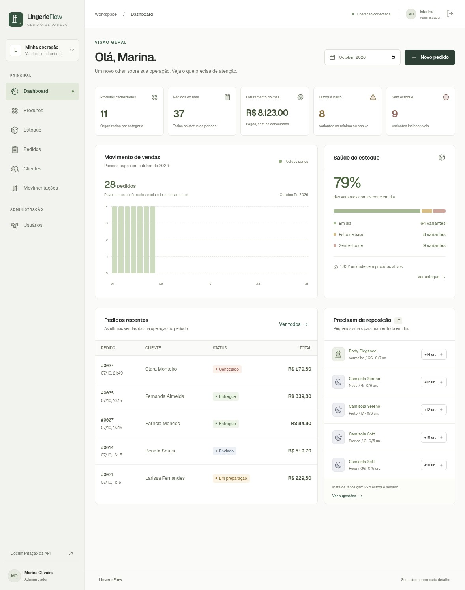

# LingerieFlow

Sistema de gestão de produtos, estoque e pedidos para o varejo de moda íntima.

## Sobre o projeto

Projeto independente de portfólio, sem vínculo oficial com empresas. Simula uma operação de varejo com vendas em lojas, e-commerce e marketplaces, focando nos fundamentos comuns desses canais: catálogo por SKU, disponibilidade, pedidos e rastreabilidade. Não integra plataformas externas nem processa pagamentos financeiros; confirmar pagamento registra uma operação administrativa no sistema.

## Problema

Um mesmo produto pode ter diferentes cores, tamanhos, preços e saldos. Controlar apenas “quantas unidades de um sutiã existem” esconde variantes indisponíveis e facilita vendas acima do estoque. Cancelamentos, reposições e contagens físicas precisam explicar cada mudança de saldo.

## Solução

O produto representa o conceito; a variante representa o item vendável. Cada variante tem SKU único, preço, saldo e mínimo próprios. Pagamentos e cancelamentos atualizam pedido, estoque e movimentações atomicamente. Bloqueios de linha e atualizações condicionais protegem vendas concorrentes; constraints PostgreSQL acrescentam proteção no banco.

## Funcionalidades

- Login JWT, senhas bcrypt e dois perfis de acesso.
- Produtos, categorias e variantes; edição e ativação/desativação.
- Estoque por cor/tamanho/SKU, entradas e ajustes por contagem física.
- Histórico com saldos anterior/posterior, motivo, responsável e pedido.
- Pedidos com vários itens, cliente opcional, preços calculados no servidor e pagamento imediato ou posterior.
- Fluxo pendente → pago → preparação → enviado → entregue.
- Cancelamento administrativo antes do envio, com devolução única do saldo consumido.
- Clientes e administração de usuários.
- Dashboard por mês, pedidos recentes, saúde do estoque e sugestões de reposição.
- Busca, filtros, paginação, validação de formulários, skeletons, estados vazios, erros e toasts.
- Interface responsiva, navegação por teclado e diálogos Radix com gerenciamento de foco.

## Tecnologias

| Área           | Tecnologias                                                                                                  |
| -------------- | ------------------------------------------------------------------------------------------------------------ |
| Frontend       | React 19, TypeScript, Vite 7, React Router, TanStack Query, React Hook Form, Zod, Radix UI, Sonner, Phosphor |
| Backend        | Node.js, TypeScript, NestJS 11, JWT, bcrypt, class-validator, Swagger/OpenAPI                                |
| Banco          | PostgreSQL 17, Prisma 6.19.3, migrations e Decimal                                                           |
| Qualidade      | Jest 30, Supertest, ESLint, Prettier, TypeScript strict                                                      |
| Infraestrutura | Docker Compose, imagens Node 24 e Nginx                                                                      |

Radix fornece os componentes acessíveis; o design é mantido no projeto. Não há dependência de shadcn/ui. Versões e dependências transitivas estão fixadas no lockfile; overrides de segurança são explicados em [architecture.md](docs/architecture.md).

## Arquitetura



```text
frontend/src/
  auth/             sessão e login
  components/       formulários, diálogos e componentes compartilhados
  lib/              cliente HTTP, tipos, queries e estado de pedido
  pages/            telas conectadas à API
backend/
  prisma/           schema, migration e seed
  src/
    auth/ users/ products/ categories/
    inventory/ orders/ customers/ dashboard/ common/
  test/             testes HTTP com PostgreSQL exclusivo
docs/               regras, arquitetura, banco e registro de manutenção
```

Detalhes em [architecture.md](docs/architecture.md).

## Modelo de dados



Índices, relações e constraints em [database.md](docs/database.md).

## Regras de negócio

- **Estoque:** não pode ser negativo; toda alteração feita pelo sistema gera uma movimentação na mesma transação.
- **Variações:** SKU globalmente único e combinação produto/cor/tamanho única.
- **Dinheiro:** Decimal(12,2); preço, subtotal e total vêm do backend. Totais enviados pelo navegador são rejeitados.
- **Pedidos pendentes:** não consomem nem reservam estoque. O pagamento verifica os saldos novamente e faz a baixa.
- **Cancelamento:** ADMIN pode cancelar pendentes, pagos ou em preparação. Pagos/em preparação devolvem saldo; pendentes não. Enviados e entregues não cancelam. Cancelar duas vezes falha.
- **Reposição:** variantes ativas com saldo ≤ mínimo; sugestão `max(0, mínimo × 2 − atual)`.
- **Dashboard:** faturamento inclui pedidos pagos no mês de referência, excluindo cancelados, em `America/Sao_Paulo`. Estoque representa o saldo atual, independentemente do mês escolhido. Alertas contam variantes, não produtos conceituais.

| Operação                                             | ADMIN | SELLER |
| ---------------------------------------------------- | ----- | ------ |
| Consultar produtos, estoque, pedidos e movimentações | Sim   | Sim    |
| Criar pedidos e avançar estados                      | Sim   | Sim    |
| Cadastrar/editar clientes                            | Sim   | Sim    |
| Produtos, variantes, categorias e ajustes de estoque | Sim   | Não    |
| Cancelar pedidos e gerenciar usuários                | Sim   | Não    |
| Dashboard operacional                                | Sim   | Sim    |
| Faturamento agregado do dashboard                    | Sim   | Não    |

Regras identificadas e critérios de aceitação em [business-rules.md](docs/business-rules.md).

## Como executar

### Opção 1: todos os serviços em Docker

Pré-requisitos: Docker Engine em execução e Docker Compose. Node.js 22.12+ é necessário apenas para o comando auxiliar `setup`; se preferir, copie `.env.example` para `.env` e preencha `JWT_SECRET` com um valor aleatório de pelo menos 32 caracteres.

```bash
npm run setup
docker compose up -d --build
docker compose ps
```

O backend espera o banco, aplica a migration e executa o seed. O seed é repetível: preserva usuários, produtos e saldos existentes e não duplica pedidos. Dados persistem no volume `postgres_data`.

- Aplicação: [http://localhost:5173](http://localhost:5173)
- API: [http://localhost:3005/api](http://localhost:3005/api)
- Swagger: [http://localhost:3005/api/docs](http://localhost:3005/api/docs)
- OpenAPI JSON: [http://localhost:3005/api/docs-json](http://localhost:3005/api/docs-json)
- Healthcheck: [http://localhost:3005/api/health](http://localhost:3005/api/health)

```bash
docker compose logs -f backend
docker compose stop
```

`stop` preserva os dados. Não remova o volume se quiser conservar sua operação.

### Opção 2: banco em Docker e desenvolvimento local

Pré-requisitos: Node.js 22.12+ (recomendado 24 LTS), npm e Docker.

```bash
npm run setup
npm ci
docker compose up -d --wait database
npm run db:generate
npm run db:migrate
npm run db:seed
npm run dev
```

Vite atende a interface em 5173 e encaminha `/api` para 3005. O PostgreSQL é exposto somente em localhost:5434. Essas portas evitam conflitos com instalações usuais. Elas podem ser alteradas em `.env`/`backend/.env`; para desenvolvimento, ajuste também o proxy em `frontend/vite.config.ts`.

Não rode os serviços Docker de frontend/backend e o desenvolvimento local nas mesmas portas ao mesmo tempo.

### Variáveis de ambiente

| Arquivo         | Variáveis                                                                                                       |
| --------------- | --------------------------------------------------------------------------------------------------------------- |
| `.env`          | `POSTGRES_USER`, `POSTGRES_PASSWORD`, `POSTGRES_DB`, `POSTGRES_PORT`, `JWT_SECRET`, `API_PORT`, `FRONTEND_PORT` |
| `backend/.env`  | `DATABASE_URL`, `JWT_SECRET`, `PORT`, `CORS_ORIGIN`, `TEST_DATABASE_URL`                                        |
| `frontend/.env` | `VITE_API_URL` (padrão `/api`)                                                                                  |

`setup` gera um segredo aleatório e preserva arquivos existentes. Exemplos estão versionados; `.env` reais são ignorados pelo Git. Os usuários de demonstração e a senha do PostgreSQL são exclusivos de desenvolvimento. O Compose publica as portas em `127.0.0.1`.

## Credenciais de demonstração

| Perfil        | E-mail                       | Senha        |
| ------------- | ---------------------------- | ------------ |
| Administrador | `admin@lingeriflow.local`    | `Admin123!`  |
| Vendedor      | `vendedor@lingeriflow.local` | `Seller123!` |

Essas credenciais são públicas e destinadas **somente a desenvolvimento/demo**. O nome do sistema é LingerieFlow; os e-mails mantêm a grafia `lingeriflow.local` especificada no briefing. O seed cadastra cinco categorias, dez produtos, oitenta variantes, oito clientes e 36 pedidos com estados variados.

## Testes

```bash
npm test
npm run lint
npm run typecheck
npm run format:check
npm run build
```

Os testes unitários verificam criação, duplicidade de SKU, classificação do saldo, quantidade válida, insuficiência de estoque, cálculo Decimal, baixa, auditoria OUT, devolução, auditoria IN, cancelamento duplicado, estados inválidos, produtos inativos, RBAC e período do dashboard.

Para integração, crie um banco exclusivo (uma única vez) e configure `TEST_DATABASE_URL` em `backend/.env`:

```bash
docker compose exec -T database psql -U lingerieflow -d postgres -c 'CREATE DATABASE lingerieflow_test;'
npm run test:e2e
```

O executor exige um nome terminado em `_test`, aplica as mesmas migrations e executa requests HTTP contra uma aplicação NestJS real. Os testes incluem vendas concorrentes da última unidade, pagamento e cancelamento concorrentes, rollback de vários itens, constraints SQL, validação e autorização. Cada execução usa SKUs/e-mails únicos e não limpa bancos ou dados de outras execuções.

Para cobertura:

```bash
npm test -- --coverage
```

## API

Todas as rotas possuem o prefixo `/api`. `POST /auth/login` e `GET /health` são públicos. Nas demais, envie `Authorization: Bearer <token>`. O JWT expira em duas horas; a sessão do navegador fica em `sessionStorage` e é revalidada ao abrir a aplicação.

Exemplo de criação de pedido:

```json
{
  "customerId": "uuid-do-cliente-opcional",
  "payImmediately": true,
  "items": [{ "productVariantId": "uuid-da-variante", "quantity": 2 }]
}
```

Erros usam `{ "statusCode": 400, "message": "...", "timestamp": "..." }`. São usados 400 para validações/regras, 401 para sessão inválida, 403 para permissão, 404 para registro ausente e 409 para duplicidade/conflito. Detalhes, DTOs e autenticação interativa estão no Swagger.

## Screenshots

O diretório [docs/screenshots](docs/screenshots/README.md) organiza capturas de dashboard, catálogo, estoque, pedido e versão mobile. Veja também o roteiro de [demonstração e validação](docs/validation.md).



[Catálogo](docs/screenshots/products-desktop.jpg) · [Estoque](docs/screenshots/inventory-desktop.jpg) · [Pedido](docs/screenshots/order-detail.jpg) · [Rastreabilidade](docs/screenshots/order-movements.jpg) · [Mobile](docs/screenshots/dashboard-mobile.jpg)

## Organização e manutenção

O [plano de implementação](IMPLEMENTATION_PLAN.md) registra as fases. O [histórico de desenvolvimento](docs/development-log.md) relaciona demandas, cenários de regressão, áreas afetadas e evidências de teste. Nenhum defeito foi introduzido propositalmente para construir esse histórico.

## Escopo deliberado

Não há integração com marketplaces, gateway de pagamento, reserva temporária, devolução após entrega, edição dos itens de um pedido já criado ou recuperação de senha. Esses fluxos exigiriam requisitos adicionais. Pedidos, pagamentos administrativos, cancelamentos e controle de saldo do escopo funcionam de ponta a ponta.
