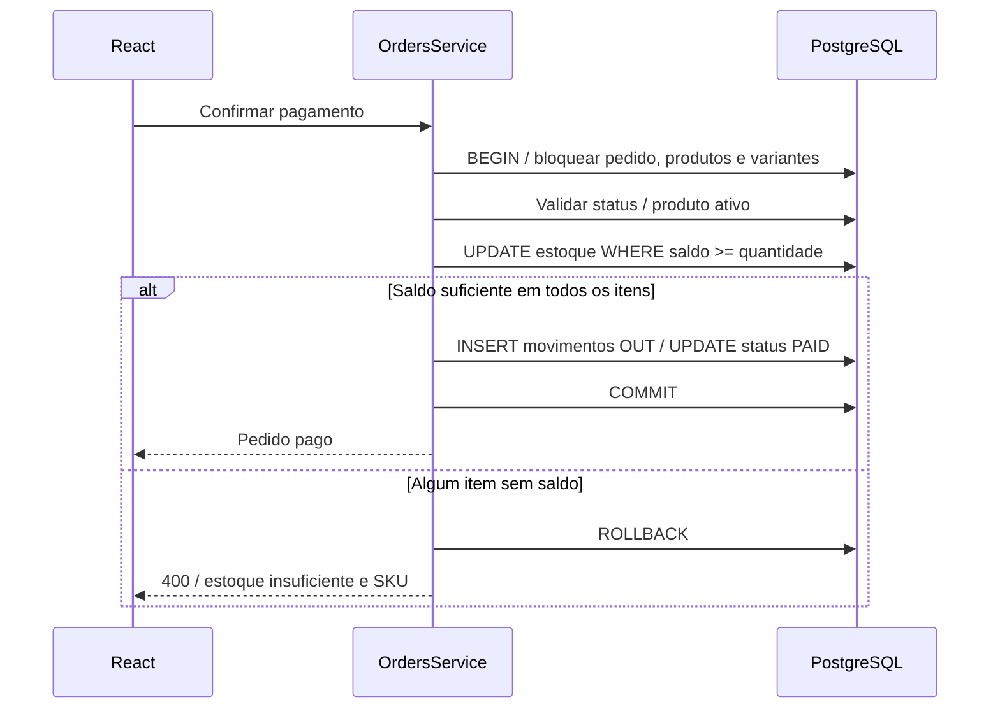

# Arquitetura

## Estrutura e responsabilidade

Monorepositório npm com dois workspaces. React e Vite são responsáveis por navegação, sessão e formulários. TanStack Query controla carregamento, cache e invalidação após gravações. React Hook Form/Zod validam a experiência do usuário; o servidor valida tudo novamente.

Controllers NestJS traduzem HTTP para chamadas de service. DTOs usam transformação explícita, `whitelist` e rejeição de propriedades extras. Services concentram regras e acessam Prisma. `common/` contém conexão, paginação, filtro de erros e bloqueio de variantes.

## Domínios

| Domínio    | Responsabilidade                                                   |
| ---------- | ------------------------------------------------------------------ |
| auth       | Login, JWT, sessão e guards globais                                |
| users      | Cadastro e consulta de usuários sem hashes de senha                |
| categories | Classificação do catálogo                                          |
| products   | Produto conceitual, variantes, ativação e estoque inicial auditado |
| inventory  | Consulta, entrada, contagem física, auditoria e filtros            |
| orders     | Preços, estados, confirmação e cancelamento                        |
| customers  | Contatos opcionais para pedidos                                    |
| dashboard  | Resumo consistente do banco por mês de referência                  |

## Segurança

Autenticação e RBAC são guards globais. Somente login e health usam `@Public`. Decorators `@Roles(ADMIN)` protegem todas as operações administrativas. O guard lê o usuário do banco a cada request: alterações futuras de perfil não dependeriam da expiração de um JWT antigo. O token assina apenas o ID, com HS256, emissor, audiência e validade de duas horas. O segredo deve ter pelo menos 32 caracteres. Senhas usam bcrypt com custo 12; hashes nunca são serializados em consultas ou relações.

Há limites de requests (120/minuto, login 10/minuto), Helmet e CORS configurável. O limite de requests é local ao processo, adequado à instância única proposta. Não substitui uma infraestrutura de autenticação distribuída.

## Transações e concorrência

Pedidos pendentes não reservam estoque. Criar pedido consulta variantes reais e guarda preços Decimal como snapshots. Pagamento bloqueia a linha do pedido, depois os produtos e variantes, sempre em ordem de UUID. Bloquear produto também serializa o pagamento contra desativação do catálogo.

Cada baixa usa `updateMany` com `currentStock >= quantity`. Se nenhuma linha for alterada, lança erro de negócio e reverte tudo, inclusive baixas já feitas em outros itens. Pedido pago e movimentos OUT são gravados na mesma transação. Cancelamento bloqueia o pedido e variantes; o estado final impede repetição. Entrada e ajuste usam o mesmo bloqueio de variante.

Dashboard usa `RepeatableRead` para evitar indicadores de momentos diferentes. Operações de estoque usam o isolamento padrão `ReadCommitted`, bloqueios explícitos e atualização condicional. Transações de pedido têm limite de 15 segundos. Não há retry automático: um erro inesperado reverte a operação e pede uma nova tentativa, sem gravar parcialmente.

## Interface

Tema claro e componentes Radix com código próprio. Fontes Geist são servidas localmente. Navegação privada, acesso de ADMIN separado, foco visível, campos ligados a rótulos, descrições de erro, modais com foco controlado e alternativa com movimento reduzido. Tabelas têm rolagem local nas telas menores; o menu vira um painel móvel. Não há `alert()` nem páginas alimentadas por mocks.

## Infraestrutura e dependências

Compose fornece PostgreSQL, backend e frontend Nginx. PostgreSQL usa volume nomeado; serviços só iniciam quando suas dependências ficam saudáveis. A API executa com usuário `node`, sem root. Nginx encaminha `/api`, evita CORS no uso normal e suporta refresh de rotas SPA. O ambiente é preparado por um script sem dependências que preserva configurações existentes.

Prisma 6.19.3 foi mantido como versão estável compatível com a API implementada, sem migrar para uma versão major durante o desenvolvimento. Os overrides `deepmerge-ts`, `effect`, `shell-quote` e `js-yaml` atualizam dependências transitivas sinalizadas na auditoria. Compatibilidade foi verificada por geração Prisma, migration, seed, Jest, e2e, Swagger e builds. npm 12 possui uma lista explícita de scripts de instalação autorizados; telemetria Scarf não é autorizada por essa lista.

## Evoluções possíveis

Uma integração real de pagamento exigiria idempotência por chave externa e webhooks autenticados. Integrações de canais precisariam de origem do pedido, mapeamento de SKUs e conciliação. Devoluções após envio exigiriam entidade e regra próprias. Nenhuma dessas complexidades é necessária para o escopo atual.

## Referências de implementação

- [NestJS: autenticação](https://docs.nestjs.com/security/authentication)
- [NestJS: OpenAPI](https://docs.nestjs.com/openapi/introduction)
- [Prisma 6: documentação no código-fonte da versão](https://github.com/prisma/prisma/tree/6.19.3)
