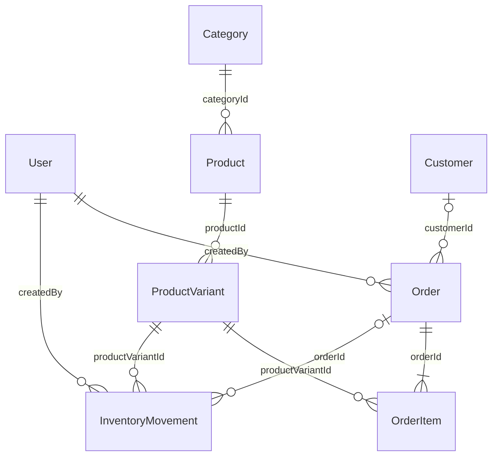

# Banco de dados

PostgreSQL 17 com Prisma 6.19.3. Modelo em `backend/prisma/schema.prisma`; migration inicial em `backend/prisma/migrations/202610070001_initial/migration.sql`. Alterações futuras devem criar novas migrations, sem editar uma já aplicada.

## Entidades

| Entidade          | Campos e responsabilidade                                                                                |
| ----------------- | -------------------------------------------------------------------------------------------------------- |
| User              | UUID, nome, e-mail único normalizado, passwordHash, role, timestamps                                     |
| Category          | UUID, nome único, timestamps                                                                             |
| Product           | UUID, nome, descrição, categoria, ativo, timestamps; não armazena saldo                                  |
| ProductVariant    | UUID, produto, SKU único, cor, tamanho, Decimal preço, saldos atual/mínimo                               |
| Customer          | UUID, nome e contatos opcionais; timestamps                                                              |
| Order             | UUID, número sequencial único, cliente opcional, estado, Decimal total, responsável, paidAt e timestamps |
| OrderItem         | UUID, pedido, variante, quantidade, Decimal preço/subtotal                                               |
| InventoryMovement | UUID, variante, tipo, quantidade, saldos anterior/posterior, motivo, pedido opcional, responsável e data |

UUIDs usam tipo nativo PostgreSQL; datas usam `timestamptz(3)`. Valores monetários são `Decimal(12,2)`. O número sequencial serve à leitura humana; relacionamentos usam UUIDs. Gaps de sequência são normais em transações revertidas.



## Constraints

- E-mail de usuário, nome de categoria, SKU e número de pedido são únicos.
- UNIQUE composto de produto/cor/tamanho; UNIQUE pedido/variante evita linhas duplicadas. O service agrega itens repetidos.
- CHECK de saldo atual/mínimo ≥ 0 e preço > 0.
- CHECK de quantidade do item > 0 e `subtotal = unitPrice × quantity`.
- CHECK de total do pedido > 0.
- Movimentações IN/OUT exigem quantidade positiva. ADJUSTMENT aceita diferença positiva ou negativa, mas não zero.
- Movimentos exigem saldos não negativos e relação aritmética correta: OUT subtrai quantidade; IN e ADJUSTMENT somam.
- FKs com `Restrict` preservam relações históricas. Não há exclusão física por endpoints.

O somatório dos itens do pedido e a obrigação de registrar uma movimentação para cada alteração são garantidos pelos services transacionais. Não há trigger que impeça um operador com acesso SQL de modificar um saldo sem auditoria; credenciais do banco devem ficar restritas. O CHECK de saldo negativo protege também writes SQL diretos.

## Índices

Produto: categoria/ativo e nome. Variante: UNIQUE SKU/matriz e saldo. Pedido: criação, status/pagamento, cliente e responsável. Movimento: variante/data, tipo/data, pedido, responsável e data. Cliente: nome. Índices B-tree de nome não aceleram necessariamente buscas `contains`; para catálogos maiores, avaliar `pg_trgm` com medidas reais, sem incluí-lo prematuramente.

## Migração e seed

```bash
npm run db:generate
npm run db:migrate
npm run db:seed
```

`db:migrate` usa `prisma migrate deploy`, inclusive no Docker. Para criar uma nova migration durante desenvolvimento: `npm exec -w backend -- prisma migrate dev --name nome-da-alteracao`.

Seed não apaga dados nem redefine saldos. Cadastra usuários/categorias com upsert sem sobrescrever alterações; identifica produtos pelos SKUs. Pedidos de exemplo são criados somente quando a tabela está vazia, pelo mesmo OrdersService usado na API. Datas de demonstração são distribuídas no mês atual; isso é preparação da massa de demo, sem endpoint que altere auditoria histórica.

## Banco de testes

Testes e2e usam `TEST_DATABASE_URL`, com nome terminado em `_test`. O executor valida esse nome antes de aplicar migrations. Testes geram identificadores únicos e deixam os registros exclusivamente nesse banco. Não truncam nem limpam bases de desenvolvimento.
